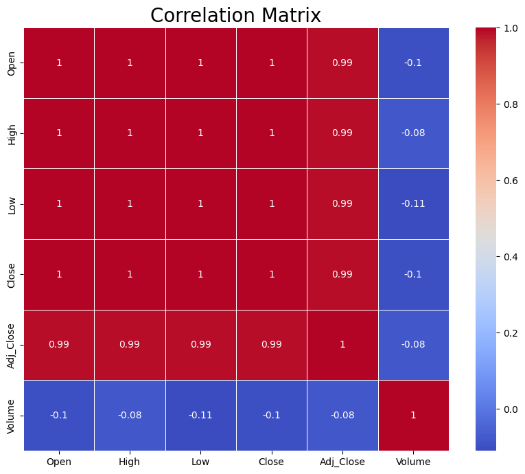
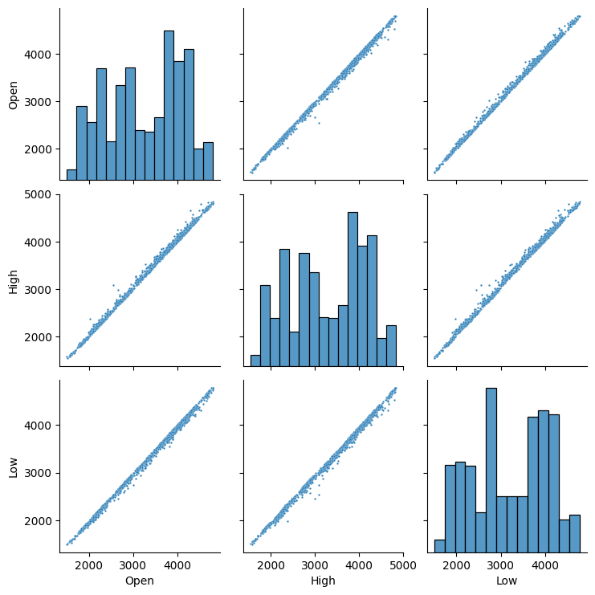
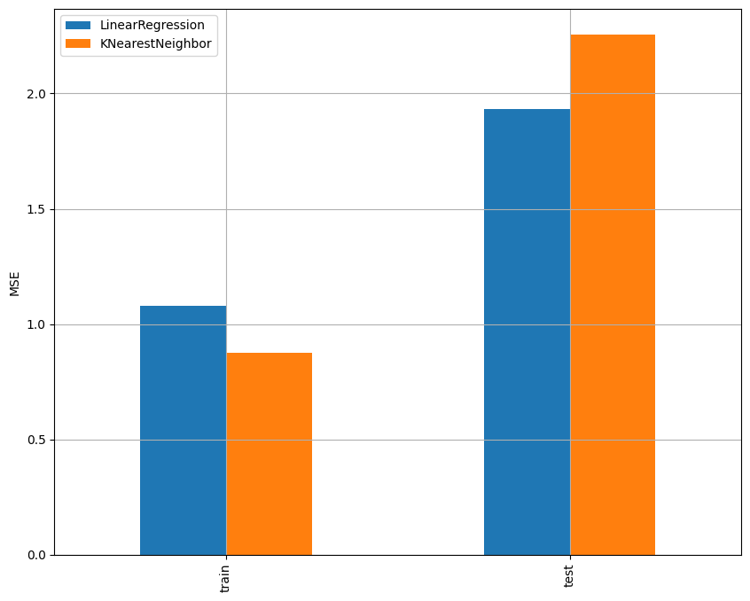

# Laporan Proyek Machine Learning - Muhammad Fadhil Abyansyah

## Domain Proyek

Saham merupakan surat resmi yang menandakan kepemilikan seorang individu atau entitas atas suatu perusahaan. Pasar saham menjadi tempat yang sangat menarik karena terjadinya penjualan saham yang sangat bergerak dinamis. Harga saham selalu berfluktuatif karena adanya faktor ekonomi yang bervariasi, seperti inflasi, dan indeks harga konsumen [[1](https://doi.org/10.1088/1742-6596/1366/1/012130)] [[2](https://doi.org/10.30984/tjebi.v3i1.653)]. Sejak lama, investor mencari keuntungan dari investasi saham di pasar modal, mendorong mereka untuk mencari harga yang sesuai. Strategi dalam melakukan investasi, seorang investor harus mampu menciptakan portofolio risiko yang kecil dan mendapatkan tingkat pengembalian yang tinggi [[3](http://dx.doi.org/10.26418/jp.v7i2.47411)]. Fluktuasi harga saham terjadi karena permintaan dan penawaran di pasar, di mana harga naik ketika permintaan tinggi dan sebaliknya [[4](https://doi.org/10.55122/blogchain.v1i2.298)].

Pada sektor telekomunikasi, PT Telkom Indonesia (Persero) Tbk (Telkom) merupakan perusahaan terkemuka yang sahamnya diperdagangkan di Bursa Efek Indonesia (BEI). Sebagai salah satu emiten terbesar di pasar modal Indonesia, Telkom memiliki dampak yang signifikan terhadap pergerakan pasar saham secara keseluruhan [[5](https://doi.org/10.33365/jdmsi.v4i1.2462)]. Oleh karena itu, analisis harga saham Telkom menjadi krusial bagi investor karena dapat memberikan gambaran tentang arah dan potensi pergerakan pasar secara umum. Sebagai contoh konkret, dengan melakukan analisis harga saham Telkom, investor dapat mengidentifikasi tren dan pola pergerakan harga saham Telkom dalam berbagai kondisi pasar. Misalnya, jika analisis menunjukkan bahwa harga saham Telkom cenderung naik ketika ada peningkatan permintaan akan layanan telekomunikasi di Indonesia, investor dapat menggunakan informasi ini untuk membuat keputusan investasi yang lebih baik. Mereka mungkin memilih untuk membeli saham Telkom saat harga masih rendah dalam antisipasi peningkatan permintaan di masa depan.

Dengan melakukan _predictive analysis_, investor dapat meramalkan perkembangan harga saham di masa mendatang. Hal ini tidak hanya memungkinkan mereka untuk membuat keputusan investasi yang lebih terinformasi, tetapi juga membantu mereka untuk mengelola risiko dan memaksimalkan potensi keuntungan.

## Business Understanding

Dalam menyusun strategi trading pada saham perusahaan Telkom, diperlukan beberapa data dan salah satunya adalah prediksi harga saham kedepannya. Ada beberapa komponen pada saham yaitu harga pembukaan, harga penutupan, harga tertinggi, harga terendah, dan volume. Dengan adanya sistem yang dapat memprediksi harga penutupan saham Telkom, tentunya dapat membantu mendapatkan profit yang lebih maksimal. Strategi trading yang didasarkan pada prediksi harga saham Telkom dapat membantu investor dalam mengelola risiko dan memaksimalkan keuntungan dengan beberapa cara. Pertama, dengan menggunakan sistem prediksi harga saham. Kedua, dengan memahami pola dan tren harga saham Telkom yang diprediksi. Terakhir, dengan memanfaatkan informasi prediksi harga saham Telkom.

### Problem Statements

- Apa faktor utama yang memiliki dampak terbesar pada prediksi harga penutupan saham Telkom?
- Bagaimana perhitungan untuk menentukan harga penutupan di Telkom bila melibatkan beragam faktor komponen?

### Goals

- Mengetahui faktor yang paling berpengaruh terhadap harga penutupan saham Telkom.
- Membuat model _machine learning_ untuk memprediksi harga penutupan dengan akurat berdasarkan data yang ada.

### Solution statements

- Melakukan ekplorasi data untuk mengetahui faktor yang paling berpengaruh terhadap harga penutupan saham Telkom seperti korelasi dan deskripsi statistik data.
- Untuk mengetahui perfoma model dilakukan pengecekan performa dengan metrik evaluasi menggunakan model _Linear Regression_ dan _K-Nearest Neighbours_.

## Data Understanding

Data yang digunakan dalam pembuatan model merupakan kumpulan harga saham Telkom pada saat perdagangan saham. Data diambil dari [Kaggle](https://www.kaggle.com) dengan nama _dataset_ yaitu [Indonesia popular stocks](https://www.kaggle.com/datasets/rischan/indonesia-popular-stocks). Berikut merupakan detail dari _dataset_ yang digunakan untuk pembuatan model:

- _Dataset_ berupa CSV
- _Dataset_ terdiri dari 2007 _records_ dengan 7 kolom yaitu: _Date_, _Open_, _High_, _Low_, _Close_, _Adj Close_, dan _Volume_.
- _Dataset_ memiliki nilai 0 dalam kolom _Volume_ sejumlah 71 _records_

### Variabel-variabel pada TLKM.JK dataset adalah sebagai berikut:

- _Date_ merupakan tanggal pada data diambil.
- _Open_ merupakan harga saham pada pembukaan perdagangan.
- _High_ merupakan harga saham tertinggi pada hari tersebut.
- _Low_ merupakan harga saham terendah pada hari tersebut.
- _Close_ merupakan harga saham pada penutupan perdagangan.
- _Adj Close_ merupakan harga saham penutupan yang telah disesuaikan dengan kondisi pasar atau aksi korporasi.
- _Volume_ merupakan jumlah saham yang diperdagangkan pada hari tersebut.

### Eksplorasi Data

- Melihat deskripsi statistik data.
- Melihat nilai yang hilang pada data. Jika ada, saya akan memutuskan apakah akan membuang baris yang mengandung nilai yang hilang, tergantung pada properti data dan tujuan analisis.
- Melihat nilai nol di _dataset_.
- Membuang nilai nol pada kolom _Volume_. Sebab hal ini dapat mengganggu analisis dan modeling.
- Melihat _outlier_ pada data.
- Melihat visualisasi korelasi antar variabel dan memutuskan untuk menggunakan variabel Open, High, dan Low sebagi fitur.
<p>
  
</p>

Gambar 1 Korelasi Metrik

Pada Gambar 1 merupakan _Correlation Matrix_ menunjukkan hubungan antar fitur dalam nilai korelasi.

- Menghapus kolom yang tidak digunakan yaitu kolom _Adj Close_ dan _Volume_.

## Data Preparation

<p>
  
</p>

Gambar 2 Visualisasi hubungan antar fitur setelah reduksi PCA

Berdasarkan Gambar 2 dapat diketahui yang memiliki hubungan antar fitur yaitu '_Open_', '_High_', '_Low_'.

Penggunaan _Principal Component Analysis_ (PCA) dalam tahapan ini bertujuan untuk mereduksi dimensi fitur dari dataset. Hal ini dilakukan dengan mengurangi kompleksitas data dan mempertahankan sebagian besar informasi yang terkandung dalam fitur asli. Dalam konteks ini, fitur yang direduksi adalah Open, High, dan Low.

- Reduksi dimensi dengan PCA bermanfaat dalam beberapa hal. Pertama, mengurangi jumlah fitur dapat mengatasi masalah "curse of dimensionality" yang dapat menyebabkan overfitting dan mempercepat proses komputasi. Kedua, PCA dapat membantu mengidentifikasi fitur-fitur yang paling penting dalam menjelaskan variabilitas data. Dalam kasus ini, komponen pertama dari PCA diambil karena memiliki proporsi informasi yang paling tinggi.
- Proporsi informasi dari setiap komponen PCA dievaluasi dengan menggunakan:

```
pca.explained_variance_ratio_.round(3)
```

Proporsi informasi tersebut menunjukkan seberapa banyak variabilitas data yang dijelaskan oleh setiap komponen PCA. Dalam contoh ini, proporsi informasi dari komponen pertama adalah 0.999, yang menunjukkan bahwa komponen tersebut secara signifikan mewakili variabilitas data.

- Setelah reduksi dimensi, data dibagi menjadi data latih dan data uji dengan rasio 80:20 menggunakan fungsi train_test_split. Pembagian data ini penting untuk menghindari overfitting dan underfitting, serta untuk mengevaluasi kinerja model secara objektif.
- Selain itu, data latih juga disesuaikan skala menggunakan StandardScaler untuk memastikan konsistensi skala di antara fitur-fitur, yang penting dalam beberapa algoritma pembelajaran mesin untuk mencapai hasil yang optimal. Dengan demikian, PCA dan langkah-langkah yang diambil setelahnya berkontribusi secara signifikan terhadap persiapan data yang efektif dan pembangunan model yang berkualitas.

## Modeling

Model yang digunakan adalah _Linear Regression_ dan _K-Nearest Neighbours_. Model-model tersebut digunakan karena dapat digunakan untuk melakukan prediksi pada data numerik. Selain itu, model-model tersebut juga dapat digunakan untuk melakukan prediksi pada data yang memiliki banyak fitur.

- #### _Linear Regression_

Untuk membuat model Linear Regression, langkah pertama adalah mengumpulkan data yang terdiri dari variabel independen (fitur) dan variabel dependen (target). Selanjutnya, data tersebut perlu dibagi menjadi data pelatihan dan data pengujian untuk evaluasi model. Setelah itu, model Linear Regression dapat dibuat dengan menggunakan algoritma yang mengestimasi koefisien untuk garis lurus terbaik yang meminimalkan selisih kuadrat antara nilai sebenarnya dan nilai yang diprediksi oleh model. Proses ini melibatkan penyesuaian garis lurus tersebut berdasarkan data pelatihan.

Kelebihan:

- Mudah untuk dipahami dan diimplementasikan.
- Dapat menangani variabel masukan numerik dan kategorikal.
- Perhitungan untuk mengestimasi koefisien dalam model _Linear Regression_ relatif cepat dan efisien, bahkan untuk _dataset_ yang besar.

Kekurangan:

- Sensitif terhadap _outlier_ dalam data yang dapat memiliki pengaruh besar pada hasil model.
- Tidak dapat menangani variabel dependen yang bersifat kategori atau data yang tidak berdistribusi normal dengan baik.
- Jika jumlah variabel independen terlalu besar dibandingkan dengan jumlah sampel dalam _dataset_, model _Linear Regression_ dapat mengalami _overfitting_,

- #### _K-Nearest Neighbours_

Pada saat membangun model _K-Nearest Neighbours_ (KNN), langkah pertama adalah menentukan nilai parameter n_neighbours=5, weights=uniform, dan algorithm=auto yang akan dipertimbangkan. Selanjutnya, saat memprediksi nilai untuk data baru, algoritma KNN mencari nilai parameter terdekat dari data baru tersebut berdasarkan jarak metrik lainnya. Kemudian, nilai target dari data baru diprediksi dengan mengambil rata-rata (dalam kasus regresi) atau mayoritas (dalam kasus klasifikasi) dari nilai target tetangga terdekat.

Kelebihan:

- Mudah untuk dipahami dan diimplementasikan.
- Dapat digunakan untuk data yang tidak linear.
- Cocok untuk data dengan distribusi tidak normal.

Kekurangan:

- Sensitif terhadap _outliers_.
- Tidak dapat menangani data yang memiliki banyak fitur.
- Sensitif terhadap skala data.

## Evaluation

Adapun metrik yang sebagai alat ukur perfoma model yang dibuat antara lain **MSE**

Berikut merupakan rumus dari metrik **MSE** yang digunakan:

$$ MSE = (1/n) Σ (y<sub>i</sub> - ŷ<sub>i</sub>)<sup>2</sup> $$

Metrik evaluasi menggunakan _Mean Squared Error_ (MSE). MSE digunakan karena MSE dapat mengukur seberapa jauh rata-rata kuadrat dari error. Selain itu, MSE juga dapat mengukur seberapa dekat data dengan garis regresi. Semakin kecil nilai MSE, maka semakin baik model yang digunakan. Untuk perbandingan, digunakan nilai MSE pada _training_ dan _testing_. Nilai MSE pada _training_ digunakan untuk melihat seberapa baik model dalam mempelajari data. Sedangkan nilai MSE pada _testing_ digunakan untuk melihat seberapa baik model dalam memprediksi data.

<p>
  
</p>

Gambar 3 Perbandingan Model

Berdasarkan hasil yang ditemukan, dapat disimpulkan model _Linear Regression_ dan _K-Nearest Neighbours_ nyaris setara performanya. Hanya saja, model _Linear Regression_ lebih baik dalam memprediksi data sedangkan model _K-Nearest Neighbours_ lebih baik dalam mempelajari data.

_Linear Regression_ lebih baik dalam memprediksi data karena memiliki nilai MSE yang lebih rendah pada data testing, menunjukkan bahwa model tersebut memiliki kesalahan prediksi yang lebih kecil dibandingkan dengan model _K-Nearest Neighbours_. Di sisi lain, _K-Nearest Neighbours_ lebih baik dalam mempelajari data karena memiliki nilai MSE yang lebih rendah pada data training, menandakan bahwa model tersebut dapat menyesuaikan diri dengan data training dengan lebih baik daripada model _Linear Regression_. Hal ini menunjukkan adanya _trade-off_ antara kemampuan mempelajari data dengan kemampuan memprediksi data di antara kedua model tersebut.

## Referensi:

[1] F. H. Mustapa and M. T. Ismail, “Modelling and Forecasting S&P 500 Stock Prices Using Hybrid Arima-Garch Model,” J Phys Conf Ser, vol. 1366, no. 1, 2019, doi: 10.1088/1742-6596/1366/1/012130.

[2] S. Saleh and R. Tabe, “Analysis Of Stock Price At Pt. Telkom Indonesia Tbk Before And After Having Damage On Its Satelit,” Tasharruf: Journal Economics and Business of Islam, vol. 3, no. 1, pp. 13–26, 2018, doi: 10.30984/tjebi.v3i1.653.

[3] W. Hastomo, A. S. B. Karno, N. Kalbuana, E. Nisfiani, and L. ETP, “Optimasi Deep Learning untuk Prediksi Saham di Masa Pandemi Covid-19,” Jurnal Edukasi dan Penelitian Informatika (JEPIN), vol. 7, no. 2, p. 133, 2021, doi: 10.26418/jp.v7i2.47411.

[4] A. Faisal, “Prediksi Saham Telkom Dengan Metode Arima,” Jurnal Bisnis, Logistik dan Supply Chain (BLOGCHAIN), vol. 1, no. 2, pp. 45–50, 2021, doi: 10.55122/blogchain.v1i2.298.

[5] A. Pambudi and Z. Abidin, “Penerapan CRISP-DM Menggunakan MLR K-FOLD Pada Data Saham PT. Telkom Indonesia (Persero) Tbk (TLKM) (Studi Kasus: Bursa Efek Indonesia Tahun 2015-2022),” JDMSI, vol. 4, no. 1, pp. 1–14, 2023.
